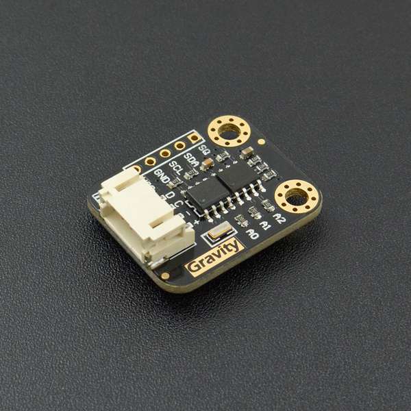

# DFRobot_DS1307
* [中文版](./README_CN.md)

The DS1307 serial real-time clock (RTC) is a low-power, full binary-coded decimal (BCD) clock/calendar 
plus 56 bytes of NV SRAM. Address and data are transferred serially through an I2C, bidirectional bus. 
The clock/calendar provides seconds, minutes, hours, day, date, month, and year information. The end of 
the month date is automatically adjusted for months with fewer than 31 days, including corrections for leap 
year. The clock operates in either the 24-hour or 12-hour format with AM/PM indicator. The DS1307 has a 
built-in power-sense circuit that detects power failures and automatically switches to the backup supply. 
Timekeeping operation continues while the part operates from the backup supply.




## Product Link (https://www.dfrobot.com/product-879.html)
    SKU: DFR0151


## Table of Contents

* [Summary](#summary)
* [Installation](#installation)
* [Methods](#methods)
* [Compatibility](#compatibility)
* [History](#history)
* [Credits](#credits)


## Summary

* Real-Time Clock (RTC) Counts Seconds, Minutes, Hours, Date of the Month, Month, Day of the week, and Year with Leap-Year Compensation Valid Up to 2100
* 56-Byte, Battery-Backed, General-Purpose RAMwith Unlimited Writes
* I2C Serial Interface
* Programmable Square-Wave Output Signal
* Automatic Power-Fail Detect and Switch Circuitry
* Consumes Less than 500nA in Battery-Backup Mode with Oscillator Running
* Optional Industrial Temperature Range:-40°C to +85°C 
* Available in 8-Pin Plastic DIP or SO
* Underwriters Laboratories (UL) Recognized


## Installation

To use this library, first download the library file, paste it into the \Arduino\libraries directory, 
then open the examples folder and run the demo in the folder.


## Methods

```C++

  /**
   * @fn begin
   * @brief Init function
   * @return true indicate init succeed; false indicate init failed
   */
  bool begin(void);

  /**
   * @fn getTime
   * @brief Get the time from rtc module and convert it to uint16_t
   * @param rtc Array for buffering the obtained time *
   * @return None
   */
  void getTime(uint16_t *rtc);

  /**
   * @fn getTypeTime
   * @brief Get the time of one type from rtc module and convert it to uint16_t
   * @param type Time type to be obtained, eTimeType_t:
   * @n eSEC, eMIN, eHR, eDOW, eDATE, eMTH, eYR
   * @return According to the selected time type, return the value uint16_t of the corresponding range
   * @n When reading eSEC type, range: 00-59
   * @n When reading eMIN type, range: 00-59
   * @n When reading eHR type, range: 00-23
   * @n When reading eDOW type, range: 01-07
   * @n When reading eDATE type, range: 01-31
   * @n When reading eMTH type, range: 01-12
   * @n When reading eYR type, range: 2000-2099
   */
  uint16_t getTypeTime(eTimeType_t type);

  /**
   * @fn setTime
   * @brief According to the available array, set all the time
   * @param rtc Array in the following format (type is uint16_t)
   * @n rtc[0] for eSEC type, range: 00-59
   * @n rtc[1] for eMIN type, range: 00-59
   * @n rtc[2] for eHR type, range: 00-23
   * @n rtc[3] for eDOW type, range: 01-07
   * @n rtc[4] for eDATE type, range: 01-31
   * @n rtc[5] for eMTH type, range: 01-12
   * @n rtc[6] for eYR type, range: 2000-2099
   * @n Note: Values out of range will result in a setting error
   * @return None
   */
  void setTime(uint16_t *rtc);

  /**
   * @fn setTypeTime
   * @brief According to the set time type, input the value in corresponding range, set time
   * @param type Time type to be obtained, eTimeType_t:
   * @n eSEC, eMIN, eHR, eDOW, eDATE, eMTH, eYR
   * @param typeTime According to the selected time type, write the value of the corresponding range
   * @n When setting eSEC type, range: 00-59
   * @n When setting eMIN type, range: 00-59
   * @n When setting eHR type, range: 00-23
   * @n When setting eDOW type, range: 01-07
   * @n When setting eDATE type, range: 01-31
   * @n When setting eMTH type, range: 01-12
   * @n When setting eYR type, range: 2000-2099
   * @n Note: Values out of range will result in a setting error
   * @return None
   */
  void setTypeTime(eTimeType_t type, uint16_t typeTime);

  /**
   * @fn start
   * @brief Start RTC timing function
   * @n this bit is part of the seconds byte
   * @return None
   */
  void start(void);

  /**
   * @fn stop
   * @brief Stop RTC timing function
   * @n this bit is part of the seconds byte
   * @return None
   */
  void stop(void);

  /**
   * @fn setSqwPinMode
   * @brief Control the operation of the SQW/OUT pin
   * @param mode SQW Pin Output mode:
   * @n eSquareWave_LOW, eSquareWave_HIGH, eSquareWave_1Hz, 
   * @n eSquareWave_4kHz, eSquareWave_8kHz, eSquareWave_32kHz
   * @return None
   */
  void setSqwPinMode(eSqwPinMode_t mode);

  /**
   * @fn getSqwPinMode
   * @brief Get the current output mode of SQW/OUT pin
   * @return eSqwPinMode_t:
   * @n eSquareWave_LOW, eSquareWave_HIGH, eSquareWave_1Hz, 
   * @n eSquareWave_4kHz, eSquareWave_8kHz, eSquareWave_32kHz
   */
  eSqwPinMode_t getSqwPinMode(void);

  /**
   * @fn saveTimeToEEPROM
   * @brief Store the current time into EEPROM, which can be used to set the time to the last saved one after power off
   * @n Call the interface when powering off and call setTimeFromEEPROM() to realize when restarting
   * @return None
   */
  void saveTimeToEEPROM(void);

  /**
   * @fn setTimeFromEEPROM
   * @brief Set the time to when last saved
   * @n If saveTimeToEEPROM() wasn’t called before or the contents in EEPROM have been modified after the call,
   * @n the time setting error may occur.
   * @note If the MCU board is reset when sensor is not powered off, the interface may be miscalled and the time may be changed by mistake.
   * @return None
   */
  void setTimeFromEEPROM(void);

  /**
   * @fn readEEPROM
   * @brief Read EEPROM through I2C bus
   * @param addr  EEPROM data address 8bits
   * @param pBuf Storage and buffer for data to be read
   * @param size Length of the data to be read
   * @return Return the read length, returning 0 indicates reading failed
   */
  size_t readEEPROM(uint8_t addr, uint8_t* pBuf, size_t size);

  /**
   * @fn writeEEPROM
   * @brief Write EEPROM through I2C bus
   * @param addr  EEPROM data address 8bits
   * @param pBuf Storage and buffer for data to be written
   * @param size Length of data to be written
   * @note The data size that users can freely store is 247 bytes, range 0-247
   * @n The last 8 bytes are for storing the time data saved when the user call saveTimeToEEPROM()
   * @return None
   */
  void writeEEPROM(uint8_t addr, const uint8_t* pBuf, size_t size);

```


## Compatibility

MCU                | Work Well    | Work Wrong   | Untested    | Remarks
------------------ | :----------: | :----------: | :---------: | :----:
Arduino Uno        |      √       |              |             |
Arduino MEGA2560   |      √       |              |             |
Arduino Leonardo   |      √       |              |             |
FireBeetle-ESP8266 |      √       |              |             |
FireBeetle-ESP32   |      √       |              |             |
FireBeetle-M0      |      √       |              |             |
Micro:bit          |      √       |              |             |


## History

- 2021/12/02 - Version 1.0.0 released.


## Credits

Written by qsjhyy(yihuan.huang@dfrobot.com), 2021. (Welcome to our [website](https://www.dfrobot.com/))

