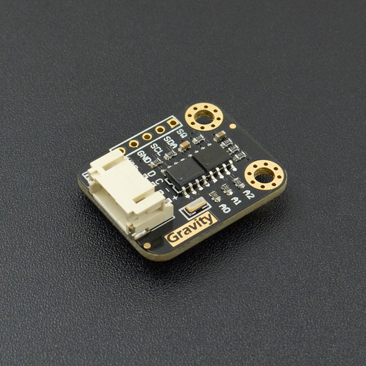

# DFRobot_DS1307
* [English Version](./README.md)

DS1307串行实时时钟(RTC)是一个低功耗、全二进制编码的十进制(BCD)时钟/日历，再加上56字节的NVSRAM。
地址和数据通过I2C双向总线串行传输。
时钟/日历提供秒、分钟、小时、日期、日期、月和年份的信息。
月底日期会自动按不足31天的月份进行调整，包括对闰年的调整。
该时钟以24小时或12小时的格式运行，并带有AM/PM指示器。
DS1307有一个内置的电源感应电路，可以检测电源故障并自动切换到备用电源。
当部件从备份供应运行时，继续计时操作。




## 产品链接 (https://www.dfrobot.com.cn/goods-535.html)
    SKU: DFR0151


## 目录

* [概述](#概述)
* [库安装](#库安装)
* [方法](#方法)
* [兼容性](#兼容性)
* [历史](#历史)
* [创作者](#创作者)


## 概述

* 实时时钟(RTC)计数秒数，分钟，小时，月的日期，月，星期，年与闰年的补偿有效至2100年
* 56字节，电池支持，通用RAM，无限写入
* I2C串行接口
* 可编程方波输出信号
* 自动断电检测和开关电路
* 电池备份时消耗小于500nA振荡器运行模式
* 可选工业温度范围:-40°C + 85°C
* 8针塑料DIP或以上
* 美国保险商实验室(UL)认证


## 库安装

要使用这个库, 首先下载库文件, 将其粘贴到\Arduino\libraries目录中, 然后打开示例文件夹并在文件夹中运行演示。


## 方法

```C++

  /**
   * @fn begin
   * @brief 初始化函数
   * @return true 表示初始化成功; false 表示初始化失败
   */
  bool begin(void);

  /**
   * @fn getTime
   * @brief 从rtc模块获取时间并转换为uint16_t
   * @param rtc 用于缓存获取的时间的数组, uint16_t *
   * @return None
   */
  void getTime(uint16_t *rtc);

  /**
   * @fn getTypeTime
   * @brief 从rtc模块获取单个类型的时间并转换为uint16_t
   * @param type 要获取的时间类型, eTimeType_t:
   * @n eSEC, eMIN, eHR, eDOW, eDATE, eMTH, eYR
   * @return 根据选择的时间类型, 返回对应范围的数值uint16_t
   * @n 读取 eSEC 类型时, 范围为: 00-59
   * @n 读取 eMIN 类型时, 范围为: 00-59
   * @n 读取 eHR 类型时, 范围为: 00-23
   * @n 读取 eDOW 类型时, 范围为: 01-07
   * @n 读取 eDATE 类型时, 范围为: 01-31
   * @n 读取 eMTH 类型时, 范围为: 01-12
   * @n 读取 eYR 类型时, 范围为: 2000-2099
   */
  uint16_t getTypeTime(eTimeType_t type);

  /**
   * @fn setTime
   * @brief 根据给的数组, 设置所有时间
   * @param rtc 按如下格式编辑的数组(类型为uint16_t)
   * @n rtc[0]为 eSEC 类型, 范围为: 00-59
   * @n rtc[1]为 eMIN 类型, 范围为: 00-59
   * @n rtc[2]为 eHR 类型, 范围为: 00-23
   * @n rtc[3]为 eDOW 类型, 范围为: 01-07
   * @n rtc[4]为 eDATE 类型, 范围为: 01-31
   * @n rtc[5]为 eMTH 类型, 范围为: 01-12
   * @n rtc[6]为 eYR 类型, 范围为: 2000-2099
   * @n 注意: 超出范围的将导致设置错误
   * @return None
   */
  void setTime(uint16_t *rtc);

  /**
   * @fn setTypeTime
   * @brief 根据选择设置的时间类型, 传入对应范围的数值, 设置时间
   * @param type 要获取的时间类型, eTimeType_t:
   * @n eSEC, eMIN, eHR, eDOW, eDATE, eMTH, eYR
   * @param typeTime 根据选择的时间类型, 写入对应范围的数值
   * @n 设置 eSEC 类型时, 范围为: 00-59
   * @n 设置 eMIN 类型时, 范围为: 00-59
   * @n 设置 eHR 类型时, 范围为: 00-23
   * @n 设置 eDOW 类型时, 范围为: 01-07
   * @n 设置 eDATE 类型时, 范围为: 01-31
   * @n 设置 eMTH 类型时, 范围为: 01-12
   * @n 设置 eYR 类型时, 范围为: 2000-2099
   * @n 注意: 超出范围的将导致设置错误
   * @return None
   */
  void setTypeTime(eTimeType_t type, uint16_t typeTime);

  /**
   * @fn start
   * @brief 启动RTC计时功能
   * @n this bit is part of the seconds byte
   * @return None
   */
  void start(void);

  /**
   * @fn stop
   * @brief 停止RTC计时功能
   * @n this bit is part of the seconds byte
   * @return None
   */
  void stop(void);

  /**
   * @fn setSqwPinMode
   * @brief control the operation of the SQW/OUT pin
   * @param mode SQW Pin 输出模式:
   * @n eSquareWave_LOW, eSquareWave_HIGH, eSquareWave_1Hz, 
   * @n eSquareWave_4kHz, eSquareWave_8kHz, eSquareWave_32kHz
   * @return None
   */
  void setSqwPinMode(eSqwPinMode_t mode);

  /**
   * @fn getSqwPinMode
   * @brief 获取 SQW/OUT pin 当前输出模式
   * @return eSqwPinMode_t:
   * @n eSquareWave_LOW, eSquareWave_HIGH, eSquareWave_1Hz, 
   * @n eSquareWave_4kHz, eSquareWave_8kHz, eSquareWave_32kHz
   */
  eSqwPinMode_t getSqwPinMode(void);

  /**
   * @fn saveTimeToEEPROM
   * @brief 将当前时间存入EEPROM, 可用于掉电重启后, 将时间设置为最后一次保存的时间
   * @n 掉电时调用此接口, 重启时调用setTimeFromEEPROM()即可实现
   * @return None
   */
  void saveTimeToEEPROM(void);

  /**
   * @fn setTimeFromEEPROM
   * @brief 将时间设置为最后一次保存的时间
   * @n 如果之前没调用过saveTimeToEEPROM(), 或者调用完后自行
   * @n 修改了EEPROM里面的内容, 则可能导致时间设置错误
   * @note 如果未使传感器掉电时复位主控板, 可能会使该接口误调用, 从而误更改时间
   * @return None
   */
  void setTimeFromEEPROM(void);

  /**
   * @fn readEEPROM
   * @brief 通过I2C总线读EEPROM
   * @param addr  EEPROM数据地址 8bits
   * @param pBuf 要读取数据的存放缓存
   * @param size 要读取数据的长度
   * @return 返回读取的长度, 返回0表示读取失败
   */
  size_t readEEPROM(uint8_t addr, uint8_t* pBuf, size_t size);

  /**
   * @fn writeEEPROM
   * @brief 通过I2C总线写EEPROM
   * @param addr  EEPROM数据地址 8bits
   * @param pBuf 要写入数据的存放缓存
   * @param size 要写入数据的长度
   * @note 用户可自由存储的数据大小为247个字节, 范围0-247
   * @n 最后8个字节是存储用户调用saveTimeToEEPROM()保存的时间数据
   * @return None
   */
  void writeEEPROM(uint8_t addr, const uint8_t* pBuf, size_t size);

```


## 兼容性

MCU                | Work Well    | Work Wrong   | Untested    | Remarks
------------------ | :----------: | :----------: | :---------: | :----:
Arduino Uno        |      √       |              |             |
Arduino MEGA2560   |      √       |              |             |
Arduino Leonardo   |      √       |              |             |
FireBeetle-ESP8266 |      √       |              |             |
FireBeetle-ESP32   |      √       |              |             |
FireBeetle-M0      |      √       |              |             |
Micro:bit          |      √       |              |             |


## 历史

- 2021/12/02 - 1.0.0 版本


## 创作者

Written by qsjhyy(yihuan.huang@dfrobot.com), 2021. (Welcome to our [website](https://www.dfrobot.com/))

