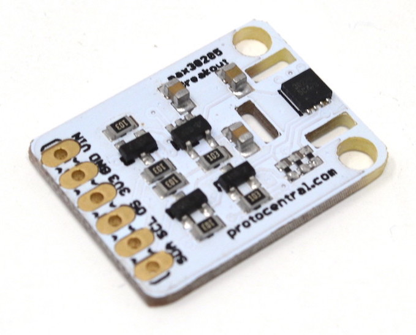
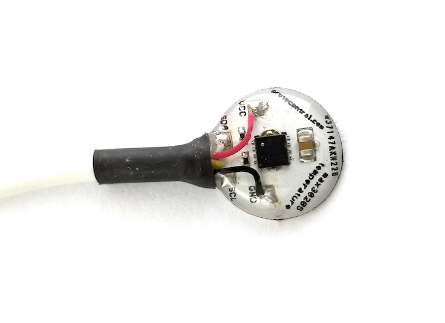
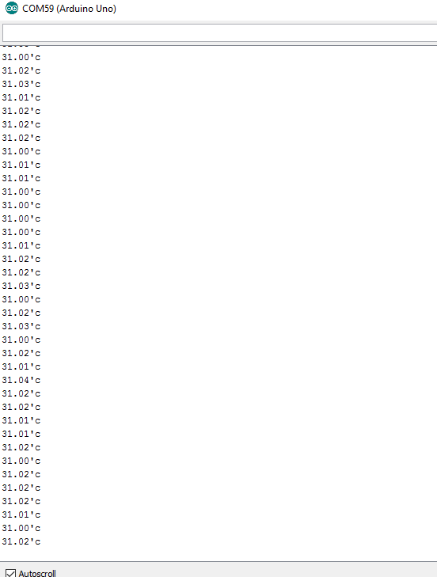

# ProtoCentral MAX30205 Human Body Temperature Sensor Breakout Board

If you don't already have one, you can buy the ProtoCentral MAX30205 breakout board from: [ProtoCentral](https://www.protocentral.com/open-source-health/1395-protocentral-max30205-body-temperature-sensor-breakout-board.html)

The QWIIC-compatible ProtoCentral MAX30205 breakout board is a wearable human body temperature sensor that reads with an accuracy of +/- 0.1 °C.This is a digital I2C-based sensor, so an ADC would not be required to read this sensor.

In addition, this version of the board is round and designed to be be directly wearable by exposing an Aluminium surface. The alumnium-base PCB helps in easy thermal conduction to make sure most of the heat gets transferred to the sensor, resulting in more accurate readings. The top side of this PCB is encapsulated in clear epoxy resin to make it waterproof. 

Unlike our previous MAX30205 breakout board, what makes it more wearable and fit for human body measurements is the use of a medical-grade biocompatible, flexible cable that does not irritate the skin.

## Features

* High Accuracy: 0.1 °C over a range of 37°C to 39°C
* Wearable, round aluminium PCB for thermal efficiency
* Waterproof 
* High quality biocompatible cable included.
* Temperature Resolution: 16-bit (0.00390625°C)
* Digital I2C 2-wire interface*

## Connecting the breakout to an Arduino

Wire the MAX30205 breakout board to an Arduino Uno(or equivalent) using the following connections.

| Arduino | MAX30205 Breakout board
| ------- |  -------------
| 5v      |    Vin (3.3V is also supported, change solder jumper behind the board. Default will be 5V)
| GND     |  GND
| A4      |  SDA
| A5      |  SCL

##  Uploading Arduino Sketch For MAX30205 breakout

1.  Open the Arduino IDE to load the embedded code for Protocentral_MAX30205.
2.  Click on File -> Open and Browse the .ino code for Arduino from Protocentral_MAX30205-master\arduino and export the application to Arduino.
3. Open serial terminal window, you should see the temperature values obtained from the Protocentral_MAX30205 Breakout Board as shown below.

# License Information

This product is open source! All hardware, software and documentation are open source and licensed under the terms of the following licenses:

## Hardware
**All hardware is released under [Creative Commons Share-alike 4.0 International](http://creativecommons.org/licenses/by-sa/4.0/).**

## Software
**All software is released under the MIT License(http://opensource.org/licenses/MIT).**

## Documentation
All product documentation is released under Creative Commons Share-alike 4.0 International.

For detailed license information, please check LICENSE.MD.

Please check [*LICENSE.md*](LICENSE.md) for detailed license descriptions.
